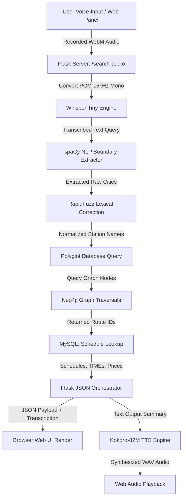

# Voice-Based Transport Gateway 🎙️✈️🚂🚌

A state-of-the-art, fully offline, voice-controlled transport search system. It utilizes a hybrid database pipeline (Neo4j + MySQL) and a local machine learning stack for speech recognition, text-to-speech synthesis, and natural language understanding.

---

## 🌟 Key Features

1. **Offline Speech Recognition (ASR)**: Powered by OpenAI's **Whisper (Tiny)** model, processing voice inputs locally with an `initial_prompt` keyword guide for high-fidelity transcription.
2. **Offline Speech Synthesis (TTS)**: Powered by **Kokoro-82M** (via `kokoro-onnx`), delivering natural, studio-quality verbal outputs offline.
3. **Conversational NLP Routing**: Uses a hybrid extraction pipeline combining **spaCy (NER)**, exact substring filters, and prepositional parsing to extract travel boundaries (Origin and Destination cities).
4. **Fuzzy Spelling Normalization**: Leverages **RapidFuzz** (Levenshtein distance scoring) to handle user pronunciation/spelling typos (e.g. *"mumbay"* ➡️ *"Mumbai"*, *"delhy"* ➡️ *"New Delhi"*).
5. **Polyglot Database Engine**:
   * **Neo4j Graph Database**: Handles station topology, connectivity paths, and station-to-station traversals.
   * **MySQL Relational Database**: Manages scheduled schedules, transport types, prices, timings, and real-time seat capacities.
6. **User Authentication & Ticket Booking**: Complete user signup/login flows integrated with real-time capacity-checking algorithms, allowing users to browse schedules, manage bookings securely, and cancel tickets dynamically.
7. **Multi-Leg Transit Routing**: Automatically resolves connecting paths when direct paths are unavailable, creating an aggregated single-transaction multi-leg booking cart experience.
8. **Administrative Command Center**: A protected web-interface for transport operators to run CRUD actions on stations, routes, and schedules in real-time.
9. **Modern Interface**: Designed with premium dark-mode styles, responsive CSS grid layouts, micro-animations, and offline fallback caching via a Service Worker.

---

## 🏗️ System Architecture & Workflow

Below is the execution flow of a single voice query:



---

## 🛠️ Technology Stack

* **Backend Orchestrator**: Python 3, Flask
* **Speech Stack**: `openai-whisper` (ASR), `kokoro-onnx` (TTS)
* **NLP & Text Normalization**: `spacy` (`en_core_web_sm`), `rapidfuzz`
* **Databases**:
  * Neo4j (Graph Network Topology)
  * MySQL (Real-time Schedules & Capacities)
* **Web Frontend**: Vanilla HTML5, CSS3 Custom Properties, Vanilla JavaScript, Service Worker (PWA-enabled)
* **Testing Suite**: Python `unittest`, `unittest.mock`

---

## 💾 Database Schemas

### 1. Neo4j Graph Topology
Stations are represented as nodes (`Station`) and connections between them are directed relationships (`CONNECTS_TO`):
```cypher
(start:Station {name: "New Delhi"})-[:CONNECTS_TO {route_id: 1}]->(end:Station {name: "Bangalore"})
```

### 2. MySQL Relational Schema
Schedules and transport assets are stored in relational tables:
```sql
CREATE TABLE Transport_Details (
    transport_id INT PRIMARY KEY AUTO_INCREMENT,
    type VARCHAR(50) NOT NULL  -- 'Train', 'Flight', 'Bus'
);

CREATE TABLE Schedules (
    schedule_id INT PRIMARY KEY AUTO_INCREMENT,
    route_id INT NOT NULL,
    transport_id INT,
    departure_time TIME,
    arrival_time TIME,
    available_seats INT,
    FOREIGN KEY (transport_id) REFERENCES Transport_Details(transport_id)
);
```

---

## 🚀 Setup & Installation

### Prerequisites
* Python 3.10+
* MySQL Server (running locally on port 3306)
* Neo4j DBMS (running locally on port 7687)
* System audio package dependencies (e.g. `ffmpeg` and `portaudio`)

### 1. Clone & Configure Python Environment
```bash
git clone https://github.com/aldhaf2007/voicebased-transport-system.git
cd voicebased-transport-system

# Create and activate environment
python3 -m venv .venv
source .venv/bin/env
# (Ensure pip is available and updated)
```

### 2. Install Packages
```bash
pip install -r requirements.txt
# If requirements.txt is not yet generated, install core packages:
pip install Flask spacy rapidfuzz pydub openai-whisper numpy kokoro-onnx soundfile mysql-connector-python neo4j
```

### 3. Install spaCy NLP Model
```bash
python3 -m spacy download en_core_web_sm
```

### 4. Configure Database Credentials
Modify `database.py` configurations or export environment variables:
```python
MYSQL_CONFIG = {
    "host": "localhost",
    "user": "root",
    "password": "YOUR_MYSQL_PASSWORD",
    "database": "transport_db",
}

NEO4J_URI = "bolt://localhost:7687"
NEO4J_USER = "neo4j"
NEO4J_PASSWORD = "YOUR_NEO4J_PASSWORD"
```

---

## 🎙️ Model Downloads (Offline Assets)

To make speech recognition and synthesis run completely offline, the following models must be placed in the project root:

1. **Whisper Model**:
   * Downloaded automatically to `~/.cache/whisper` on the first run of the script.

2. **Kokoro TTS Models**:
   * Download the ONNX model: [kokoro-v1.0.onnx](https://github.com/thewh1teagle/kokoro-onnx/releases/download/model-files-v1.0/kokoro-v1.0.onnx)
   * Download the voice binaries: [voices-v1.0.bin](https://github.com/thewh1teagle/kokoro-onnx/releases/download/model-files-v1.0/voices-v1.0.bin)
   * Place both files in the root folder of the project.

---

## 💻 Running the Application

1. **Start your local MySQL and Neo4j servers**.
2. **Execute the backend application**:
   ```bash
   python3 app.py
   ```
3. Open your browser and navigate to `http://localhost:5000`.
4. Click the **Microphone** icon to record a search request like: *"Show me flights from Delhi to Mumbai"* or *"Find trains from Bangalore to Mumbai"*.

---

## 🧪 Running Tests

To verify speech routing logic, NLP extraction nodes, database wrappers, and TTS endpoints, execute the mock-patched test suite:
```bash
python3 test_app.py
```
