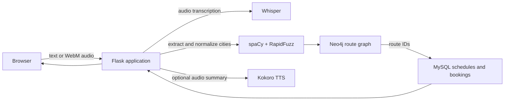

# Voice Transport System

A local Flask web application for finding and booking transport services with typed or spoken requests. It combines a Neo4j route graph with MySQL schedule and booking data, and can run speech recognition and speech synthesis locally.

## What it does

- Finds direct routes and connections of up to five legs.
- Understands requests such as `find trains from Delhi to Mumbai`, including common station-name misspellings.
- Supports browser-recorded voice search through Whisper and spoken search summaries through Kokoro TTS.
- Provides user sign-up, sign-in, booking, cancellation, and a per-user booking history.
- Lets an administrator manage stations, routes, and schedules.
- Caches the frontend shell with a service worker. Search, authentication, booking, and admin requests always remain network requests.

## Architecture


```mermaid
flowchart LR
    U[Browser] -->|text or WebM audio| F[Flask application]
    F -->|audio transcription| W[Whisper]
    F -->|extract and normalize cities| N[spaCy + RapidFuzz]
    N --> G[Neo4j route graph]
    G -->|route IDs| M[MySQL schedules and bookings]
    M --> F
    F -->|optional audio summary| K[Kokoro TTS]
    F --> U
```

Neo4j holds stations and the `CONNECTS_TO` route relationships. MySQL holds transport types, schedules, users, and bookings. See [docs/architecture.md](docs/architecture.md) for the data model and request flow.

## Prerequisites

- Python 3.10 or newer
- MySQL Server, with a `transport_db` database
- Neo4j, available over Bolt (default: `bolt://localhost:7687`)
- `ffmpeg` installed and available on `PATH` for browser audio decoding
- Optional but needed for voice features: local Whisper and Kokoro model files

## Quick start

1. Create the MySQL database and add the base transport tables:

   ```sql
   CREATE DATABASE transport_db;
   USE transport_db;

   CREATE TABLE Transport_Details (
       transport_id INT PRIMARY KEY,
       type VARCHAR(50) NOT NULL
   );

   INSERT INTO Transport_Details (transport_id, type)
   VALUES (1, 'Flight'), (2, 'Train'), (3, 'Bus');

   CREATE TABLE Schedules (
       schedule_id INT PRIMARY KEY AUTO_INCREMENT,
       route_id INT NOT NULL,
       transport_id INT NOT NULL,
       departure_time TIME NOT NULL,
       arrival_time TIME NOT NULL,
       available_seats INT NOT NULL,
       FOREIGN KEY (transport_id) REFERENCES Transport_Details(transport_id)
   );
   ```

   On application startup, `Bookings` and `Users` are created automatically if the MySQL connection succeeds.

2. Create and activate a virtual environment:

   ```bash
   python3 -m venv .venv
   source .venv/bin/activate
   python -m pip install --upgrade pip
   ```

3. Install the Python packages:

   ```bash
   pip install Flask spacy rapidfuzz pydub openai-whisper numpy kokoro-onnx soundfile onnxruntime mysql-connector-python neo4j
   python -m spacy download en_core_web_sm
   ```

4. Configure services. Neo4j credentials can be set with environment variables; MySQL connection values currently live in `database.py`.

   ```bash
   export NEO4J_URI='bolt://localhost:7687'
   export NEO4J_USER='neo4j'
   export NEO4J_PASSWORD='replace-with-your-password'
   export FLASK_SECRET_KEY='replace-with-a-random-secret'
   export ADMIN_USERNAME='admin@example.local'
   export ADMIN_PASSWORD='replace-with-a-strong-password'
   ```

5. Create stations and routes in Neo4j. Routes must have a `route_id` which matches the `Schedules.route_id` value in MySQL. The administrator dashboard can create these after at least two stations exist.

   ```cypher
   CREATE (:Station {name: 'New Delhi'});
   CREATE (:Station {name: 'Mumbai'});
   MATCH (a:Station {name: 'New Delhi'}), (b:Station {name: 'Mumbai'})
   CREATE (a)-[:CONNECTS_TO {route_id: 1}]->(b),
          (b)-[:CONNECTS_TO {route_id: 2}]->(a);
   ```

   Then insert schedules whose route IDs are `1` or `2`, or add them through the admin dashboard.

6. Start the application and open <http://localhost:5000>:

   ```bash
   python app.py
   ```

## Voice assets

Text search works without the speech models. Voice search and spoken summaries require the following assets:

- Whisper `tiny` downloads on first successful load to the standard Whisper cache.
- `kokoro-v1.0.onnx` and `voices-v1.0.bin` must be placed in the project root. The application loads both filenames directly.

If either model cannot load, the app starts but its corresponding voice endpoint returns `503 Service Unavailable`.

## Using the application

1. On the home page, enter a route request or use the microphone button.
2. Choose a direct option or a set of transit legs.
3. Sign up or sign in before confirming a booking.
4. Visit **My Bookings** to view or cancel your bookings. Successful bookings also create a local text receipt in a project-root folder named after the username.
5. Sign in at `/admin-login` to manage the network and timetable. Set `ADMIN_USERNAME` and `ADMIN_PASSWORD`; the built-in defaults are suitable only for local development.

## API reference

The browser UI consumes the same Flask endpoints. Common programmatic endpoints are documented in [docs/api.md](docs/api.md).

## Tests

Run the unit test suite with:

```bash
python -m unittest test_app.py
```

Some tests exercise database-backed behaviour and therefore require the configured services and seed data. `test_session.py` is a Selenium smoke-test script; start the app before running it and ensure ChromeDriver is available.

## Project layout

```text
app.py                    Flask routes, NLP, speech integration, and booking flow
database.py               Neo4j/MySQL access and transactional booking logic
templates/                Server-rendered HTML pages
static/js/main.js         Browser search, recording, rendering, and cache behaviour
static/css/style.css      Interface styling
static/service-worker.js  PWA asset cache
docs/                     Architecture and API documentation
test_app.py               Unit and route tests
```

## Operational notes

- Treat the Flask development server and the fallback secret/admin credentials as development-only settings.
- Backup MySQL before deleting stations or routes: those actions remove related schedule records.
- Neo4j route IDs and MySQL schedule route IDs are an application-level contract; keep them synchronized.
- Bookings use MySQL transactions and row locks to avoid overselling seats. Multi-leg bookings succeed only if every leg has capacity.

## Further reading

- [Architecture and data model](docs/architecture.md)
- [HTTP API reference](docs/api.md)
